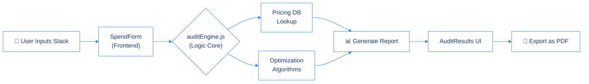

<!-- ═══════════ ANIMATED HEADER ═══════════ -->

# 🚀 CostVision AI

<div align="center">
<!-- ═══════════ TYPING ANIMATION ═══════════ -->

<br/>

<!-- ═══════════ BADGES ═══════════ -->

&nbsp;

&nbsp;

&nbsp;

&nbsp;


<br/>


&nbsp;

&nbsp;

&nbsp;

&nbsp;


</div>

<div align="center">

<a href="https://spendinspenza.vercel.app/" target="_blank">
  
</a>

</div>

-----

## 💸 What is CostVision AI?

**CostVision AI** is an intelligent, free audit platform designed to help startups analyze and optimize their AI tool spending. Most teams overpay for subscriptions to tools like ChatGPT, Claude, Copilot, and Cursor without realizing it. CostVision AI instantly analyzes your usage and provides actionable recommendations to cut costs by 30-60%.

Whether you're an indie hacker or scaling a massive team — **CostVision AI** gives you the financial visibility you need in the AI era.

> *"Find out if you're overpaying for AI tools. Stop guessing, start optimizing."*

### ✨ Core Philosophy
- 🎯 **Simplicity first** — clean, intuitive UI that asks only what is necessary
- ⚡ **Speed** — instant audit generation in milliseconds
- 📊 **Actionable Insights** — we don't just show your spend, we tell you exactly how to cut it

---

## 🚀 Features

<div align="center">

| Feature | Description | Status |
|---------|-------------|--------|
| 💰 **Instant Spend Audit** | Calculates current monthly & annual AI expenses instantly | ✅ Active |
| 🤖 **Smart Tool Optimization** | Automatically detects overkill plans and suggests cheaper alternatives | ✅ Active |
| 📄 **Dynamic PDF Reports** | Generates beautiful, shareable PDF documents of your audit results | ✅ Active |
| 🌐 **Modern Next.js Frontend** | Beautiful glassmorphism UI with subtle, premium micro-animations | ✅ Active |
| ✉️ **Automated Emails** | Built-in email capabilities via Resend for sending reports & leads | ✅ Active |
| 🛡️ **Rate Limiting** | Integrated API protection to prevent spam and abuse | ✅ Active |

</div>

---

## 🛠️ Tech Stack

<div align="center">

### 💻 Frontend & Framework


### 🧠 Logic & Data


### 🔧 Tools & DevOps


</div>

---

## 🗂️ Project Structure

```
📦 CostVision_AI/
├── 📁 app/                ← Next.js App Router (Pages, Layouts, API Routes)
├── 📁 components/         ← Reusable React UI Components (AuditResults, SpendForm, etc.)
├── 📁 data/               ← Core Engine Logic, Pricing Data, and Rate Limiters
├── 📁 public/             ← Static assets and icons
└── 📄 globals.css         ← Global Tailwind styling & animations
```

---

## ⚙️ Architecture Overview



---

## 🚦 Quick Start

### Prerequisites

```bash
# Make sure you have Node.js 18+ installed
node --version

# Install dependencies
npm install
```

### 🖥️ Run the Web Interface Locally

```bash
# 1. Clone the repository
git clone https://github.com/Umangpandey75/CostVision_AI.git

# 2. Navigate to the project directory
cd CostVision_AI

# 3. Start the development server
npm run dev

# 4. Open http://localhost:3000 in your browser
```

---

## 🎮 How to Use

<div align="center">

```
  Step 1             Step 2              Step 3              Step 4
     💼                 🛠️                  🧠                  📄
Input Team Size  →  Select AI Tools  →  Engine Audits  →  Get PDF Report
```

</div>

### 🗣️ Core Workflows

| Action | Result |
|---------|--------|
| **Add a Tool** | Selects from predefined tools (Claude, ChatGPT, etc.) |
| **Run Audit** | Calculates current spend vs optimized spend instantly |
| **Download PDF** | Generates a perfectly formatted, branded PDF report |
| **Share Report** | Copies a shareable URL to send to stakeholders |

---

## 📸 Interface Highlights

<div align="center">

> ☀️ **Clean, Premium SaaS UI** — minimalist, trustworthy, and focused

```
┌──────────────────────────────────────────┐
│                                          │
│    [ - ]  CostVision AI                  │
│                                          │
│   ┌────────────────────────────────┐     │
│   │ "Are you overpaying for AI?"   │     │
│   └────────────────────────────────┘     │
│                                          │
│          [  Run Free Audit  ]            │
│                                          │
│                                          │
└──────────────────────────────────────────┘
```

**Design System:** Modern gradients, soft radial glows, subtle entrance animations, and crisp typography.

</div>

---

## 🤝 Contributing

Contributions are what make the open-source community amazing! Here's how you can help:

```bash
# 1. Fork the repository on GitHub
# 2. Create your feature branch
git checkout -b feature/AmazingFeature

# 3. Commit your changes
git commit -m '✨ Add AmazingFeature'

# 4. Push to the branch
git push origin feature/AmazingFeature

# 5. Open a Pull Request 🎉
```

### 💡 Ideas for Contribution
- [ ] 🌍 Expand pricing database with more specialized AI tools
- [ ] 📊 Add historical spend tracking and charts
- [ ] 🔐 Implement user accounts to save multiple audits
- [ ] 📧 Enhance email sequences for captured leads

---

## 📜 License

Distributed under the **MIT License**. See [`LICENSE`](LICENSE) for more information.

---

## 👨‍💻 Author

<div align="center">

### **Umang Pandey**
*Software Developer · UI/UX Enthusiast · Full Stack Engineer*

[](mailto:umangpandey.co@gmail.com)
&nbsp;
[](https://linkedin.com/in/umang-pandey-01b486273)
&nbsp;
[](https://github.com/Umangpandey75)
&nbsp;
[](https://umangpandey.vercel.app)

*"Building elegant solutions for modern problems. ✨"*

</div>

---

## ⭐ Show Your Support

If **CostVision AI** helped you optimize your spend, please give it a ⭐ — it means the world!

<div align="center">

[](https://github.com/Umangpandey75/CostVision_AI/stargazers)
&nbsp;
[](https://github.com/Umangpandey75/CostVision_AI/fork)
&nbsp;
[](https://twitter.com/intent/tweet?text=Check+out+CostVision+AI+by+%40Umangpandey75!+Stop+overpaying+for+AI+tools!+%F0%9F%92%B8%E2%9C%A8&url=https://github.com/Umangpandey75/CostVision_AI)

</div>
---
<!-- ═══════════ FOOTER WAVE ═══════════ -->


<div align="center">

*Made with ❤️ by [Umang Pandey](https://github.com/Umangpandey75) · © 2026 CostVision AI*


</div>
